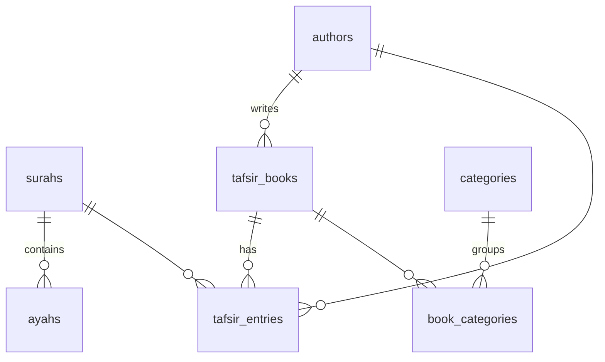

# قاعدة بيانات Cloudflare D1 — تفسير

هذا المجلد يحتوي على ترحيلات SQL الخاصة ببنية بيانات التطبيق على Cloudflare D1.

> **حالة الترحيل:** *مُعدّ مسبقًا (لم يُطبَّق على D1 إنتاج بعد)* — التطبيق حاليًا
> يقرأ بياناته من ملفات TypeScript الثابتة في `src/data/*`. الترحيل يجهّز البنية
> للانتقال السلس لاحقًا دون تغيير في الواجهة.

## الملفات

```
db/
├── README.md                       # هذا الملف
└── migrations/
    └── 0001_initial_schema.sql     # المخطّط الأوّلي الكامل
```

## الجداول

| الجدول | الوصف |
|---|---|
| `surahs` | السور الـ114 (ثابت) |
| `ayahs` | نصوص الآيات + الجزء/الصفحة |
| `authors` | المؤلفون والمفسرون |
| `tafsir_books` | كتب التفسير (الطبري، ابن كثير، …) |
| `tafsir_entries` | **النصوص التفسيرية** + التوثيق العلمي |
| `categories` | الموضوعات والفهارس |
| `book_categories` | ربط كتب بمواضيع (m-to-m) |
| `import_jobs` | سجلّ مهام الاستيراد |
| `audit_logs` | سجلّ التدقيق |

### قيود وفهارس مهمّة

- `tafsir_entries` يلزمها دائمًا قِيَم لـ `source_type` و `verification_status`
  (CHECK constraint). لا يمكن إدخال صف بدونهما.
- `UNIQUE (book_id, surah_number, ayah_number, source_name)` يمنع التكرار.
- فهارس على: `surah_number`, `ayah_number`, `book_id`, `author_id`,
  `source_type`, `verification_status`, ومركّب `(surah, ayah)` و
  `(book, surah, ayah)` لاستعلامات سريعة.
- جدول FTS5 افتراضي `tafsir_entries_fts` للبحث الحرّ مع تنظيف الحركات
  (`unicode61 remove_diacritics 2`).

## كيف نطبّق الترحيل لاحقًا (عند الانتقال إلى D1)

```bash
# 1) إنشاء قاعدة الإنتاج (مرة واحدة)
npx wrangler d1 create tafseer-production

# 2) في wrangler.jsonc أضِف d1_databases binding يربط DB → tafseer-production

# 3) محليًا
npx wrangler d1 migrations apply tafseer-production --local

# 4) إنتاجيًا
npx wrangler d1 migrations apply tafseer-production
```

> **تنبيه:** أمر `wrangler d1 migrations` يبحث افتراضيًا عن المسار `migrations/`؛
> اضبط `migrations_dir = "db/migrations"` في `wrangler.jsonc` أو انسخ
> الملفات إلى `migrations/` عند تفعيل D1 فعليًا.

## مخطّط البيانات بمختصر


